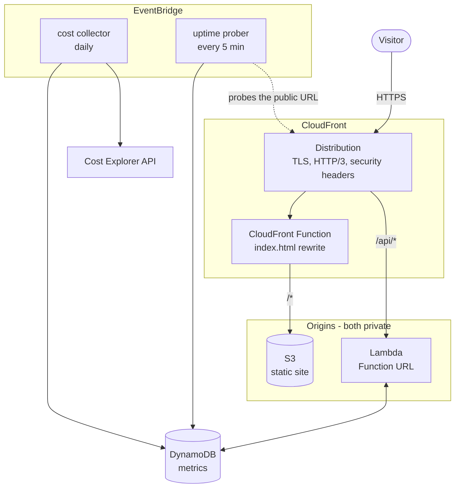

# personal-site-automation

Infrastructure and delivery pipeline for a personal site on AWS. The site itself
lives in [`personal-site-gatsby`](https://github.com/jallyn18/personal-site-gatsby);
this repository owns everything underneath it.

Static site on S3 behind CloudFront, a small JSON API on Lambda, and two
scheduled collectors that publish the site's own uptime and running cost back to
the page. All of it is Terraform, deployed by GitHub Actions with no long-lived
AWS credentials anywhere.

## Architecture



Both origins are private. S3 has no public access and no bucket ACLs; the Lambda
Function URL is set to `AWS_IAM` auth. CloudFront reaches each one through an
Origin Access Control that signs every request with SigV4, so the only way to
either origin is through the distribution.

Putting the API on the same distribution as the site means the browser makes
same-origin requests to `/api/*`. No CORS preflights, no API Gateway, no second
domain to certificate.

## What runs where

| Component | Service | Notes |
| --- | --- | --- |
| Static site | S3 + CloudFront | Private bucket, OAC, `PriceClass_100` |
| API | Lambda Function URL | Python 3.12 on arm64, single file, no dependencies |
| Metrics | DynamoDB | One table, on-demand, TTL on ephemeral rows |
| Uptime | Lambda + EventBridge | Probes the public URL every 5 minutes |
| Cost | Lambda + EventBridge | Cost Explorer snapshot, daily |
| DNS | Route53 | Apex + `www`, A and AAAA aliases |
| Certificates | ACM (us-east-1) | DNS validated, renews itself |
| Alerting | SNS + CloudWatch + Budgets | Email on site down, function errors, spend |

## API

Served at `/api/*` through CloudFront.

| Route | Method | Returns |
| --- | --- | --- |
| `/api/health` | GET | Liveness, touches no data |
| `/api/visits` | GET | Current visit count |
| `/api/visits` | POST | Records a visit, returns the new count |
| `/api/status` | GET | Availability, average and last latency |
| `/api/cost` | GET | Month-to-date spend and month-end forecast |

Visits are deduplicated per visitor per day. The dedupe key is a salted SHA-256
of the IP address and user agent, truncated to 128 bits — the raw IP is never
written to the table, and the salt is generated at deploy time so digests are
not correlatable across deployments. Rows expire after 48 hours via TTL.

The conditional `PutItem` that claims the key is also the concurrency control:
two simultaneous requests from the same visitor race, one wins, and the counter
moves exactly once.

## Cost

Roughly **$1–2/month**, dominated by fixed charges rather than traffic:

| Item | Monthly |
| --- | --- |
| Route53 hosted zone | $0.50 |
| Cost Explorer API (2 requests/day) | ~$0.60 |
| CloudFront, S3, Lambda, DynamoDB | Cents at personal-site traffic |

The Cost Explorer line is the interesting one: at $0.01 per request, polling it
per page view would cost more than everything else combined. The collector runs
once a day and the API serves the cached snapshot from DynamoDB for free.

A monthly AWS Budget alerts at 80% of actual and 100% of forecast spend.

## Security posture

- **No static AWS credentials.** GitHub Actions authenticates with OIDC and
  assumes a role scoped to a specific repository and ref. The only thing stored
  in GitHub is a role ARN, which is not a secret.
- **Two roles, not one.** The site repository gets a deploy role that can write
  to one bucket prefix and invalidate one distribution — it cannot read state,
  touch IAM, or modify infrastructure.
- **Fork pull requests cannot deploy.** The trust policy names
  `ref:refs/heads/main` for deploys; plan jobs additionally require the PR to
  originate from this repository.
- **Least privilege per function.** Each Lambda has its own role. The uptime
  prober cannot read cost data; the cost collector cannot read the visit counter.
- **Private origins.** No public S3 URL, no public Function URL.
- **TLS enforced end to end.** Bucket policies deny non-TLS requests, CloudFront
  redirects HTTP to HTTPS with HSTS preload, minimum TLS 1.2.
- **Scanning in CI.** Trivy for IaC misconfigurations and dependency CVEs,
  gitleaks for committed secrets, both uploading SARIF to the Security tab.
- **Drift detection.** A scheduled read-only plan opens an issue when the live
  account stops matching the committed code.

## Pipelines

| Workflow | Trigger | Does |
| --- | --- | --- |
| `terraform.yml` | PR, push to `main` | fmt, validate, plan, apply |
| `python.yml` | PR, push | ruff, mypy, pytest on 3.12 and 3.13 |
| `security.yml` | PR, push, weekly | Trivy IaC + dependency scan, gitleaks |
| `drift.yml` | Daily 08:00 UTC | Plan against live state, open an issue on drift |

`terraform.yml` applies the exact plan artifact produced by the plan job rather
than re-planning, so what gets reviewed is what gets applied. The `production`
environment gates applies — add required reviewers in repository settings to
require a human approval.

## Setup

**[docs/GETTING-LIVE.md](docs/GETTING-LIVE.md) is the step-by-step runbook.**
Short version below.

### The bootstrap problem

Terraform cannot store state before its state bucket exists, and GitHub Actions
cannot assume a role that has not been created yet. Something must come from
outside Terraform.

`bootstrap/cloudformation.yaml` is that something. Deployed once from the AWS
console, it creates exactly three things — the GitHub OIDC provider, the role
the pipeline assumes, and the state bucket — and nothing else. The alternative
is putting AWS access keys in GitHub secrets to bootstrap and then removing
them; this avoids that, so **no long-lived AWS credentials exist at any point.**

### From nothing to deployed

1. **Deploy the bootstrap stack** in the CloudFormation console. Note its three
   outputs.
2. **Set repository variables** in this repo: `AWS_TERRAFORM_ROLE_ARN`,
   `TF_STATE_BUCKET`, `AWS_OIDC_PROVIDER_ARN`, `DOMAIN_NAME`, `ALERT_EMAIL`.
   Variables rather than secrets — a role ARN grants nothing on its own.
3. **Run the terraform workflow on a branch.** It validates and plans without
   applying, so you can read the plan before anything changes.
4. **Merge to `main`.** Plan runs again and applies.
5. **Set `AWS_DEPLOY_ROLE_ARN`** in the site repository and merge there. The
   site deploys.
6. **Delegate the domain**, then set `ENABLE_CUSTOM_DOMAIN=true` and re-run.

`terraform/ci.tfvars` records that the OIDC provider and Terraform role are
CloudFormation-managed on this path. Everything else — the domain, the alert
address, the provider ARN — arrives as repository variables.

The site repository discovers the bucket name, distribution id, and site URL
from SSM Parameter Store at deploy time, so nothing about the infrastructure is
duplicated into it.

### Running Terraform from a workstation instead

`scripts/setup.sh` drives the whole sequence locally: it validates, creates the
state bucket with `terraform/bootstrap`, writes `backend.hcl`, and applies. On
that path Terraform creates the role and state bucket itself — leave
`create_terraform_role` at its default and do not pass `ci.tfvars`.

## Local development

```bash
make install     # dev dependencies
make check       # everything CI runs: lint, types, tests, fmt, validate
make test        # unit tests only
```

Tests use [moto](https://github.com/getmoto/moto) to stand up DynamoDB in
process. No AWS credentials are needed, and the fixtures inject fake ones so a
test that escapes moto fails loudly rather than reaching a real account.

## Layout

```
bootstrap/
  cloudformation.yaml  OIDC provider, pipeline role, state bucket; console-deployed once
terraform/
  bootstrap/        same three-ish resources for the local path; local state
  ci.tfvars         records what CloudFormation owns on the pipeline path
  cloudfront.tf     distribution, OACs, edge function, security headers
  dns.tf            hosted zone, ACM certificate, alias records
  s3.tf             site bucket and its policies
  lambda.tf         three functions, three roles, packaging
  dynamodb.tf       single metrics table
  schedules.tf      EventBridge rules for the collectors
  oidc.tf           GitHub OIDC provider and the two CI roles
  monitoring.tf     SNS, budget, alarms
  ssm.tf            deploy configuration for the site repository
lambdas/
  api/              /api/* request handler
  uptime/           scheduled prober
  cost/             scheduled Cost Explorer snapshot
tests/              pytest suite covering all three functions
```
